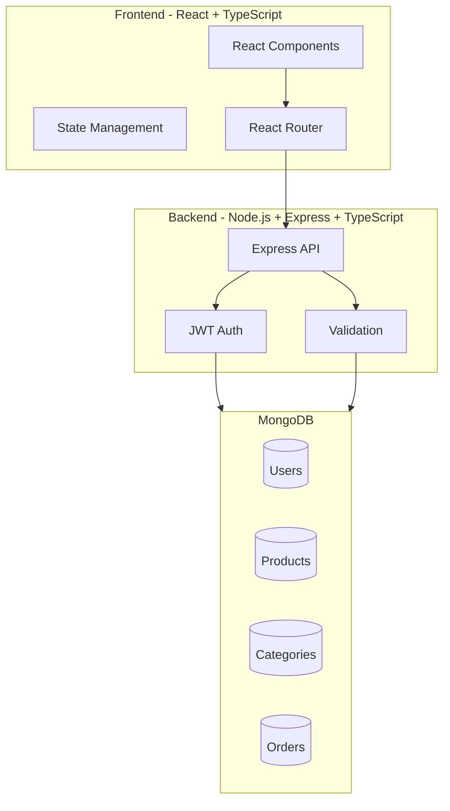
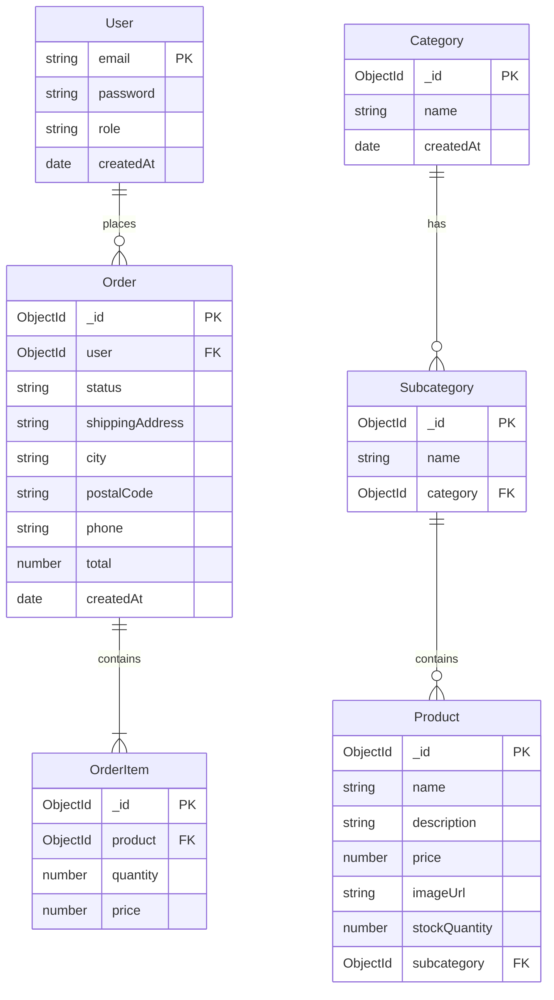
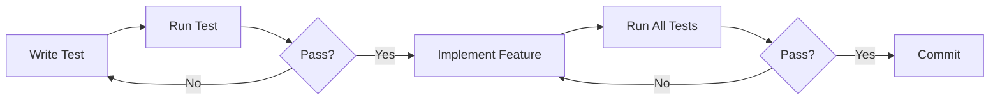

I'll create a comprehensive README.md file for your project:

```markdown:README.md
# E-commerce Platform

A full-stack e-commerce platform built with MERN stack (MongoDB, Express.js, React, Node.js) with TypeScript support.

## Features

- 🔐 User Authentication & Authorization
- 👥 Role-based Access (Admin/Customer)
- 📱 Responsive Design
- 🛍️ Product Management
- 📂 Category & Subcategory Management
- 🛒 Shopping Cart
- 📦 Order Processing
- 📊 Admin Dashboard

## System Architecture



## Database Schema



## Project Structure

```
├── client/                 # Frontend React application
│   ├── src/
│   │   ├── components/    # React components
│   │   ├── context/      # React context providers
│   │   ├── pages/        # Page components
│   │   ├── services/     # API services
│   │   └── types/        # TypeScript types
│   └── package.json
│
├── server/                # Backend Express application
│   ├── src/
│   │   ├── controllers/  # Route controllers
│   │   ├── middleware/   # Express middleware
│   │   ├── models/       # Mongoose models
│   │   ├── routes/       # Express routes
│   │   └── types/        # TypeScript types
│   └── package.json
│
└── README.md
```

## API Documentation

### Authentication
- `POST /api/auth/signup` - Register new user
- `POST /api/auth/login` - Login user

### Categories
- `GET /api/categories` - Get all categories
- `POST /api/categories` - Create category (Admin)
- `GET /api/categories/:id/subcategories` - Get subcategories
- `POST /api/categories/:id/subcategories` - Create subcategory (Admin)

### Products
- `GET /api/products` - Get all products
- `POST /api/products` - Create product (Admin)
- `PUT /api/products/:id` - Update product (Admin)
- `DELETE /api/products/:id` - Delete product (Admin)

### Orders
- `POST /api/orders` - Create order
- `GET /api/orders/my-orders` - Get user orders
- `GET /api/orders` - Get all orders (Admin)
- `PATCH /api/orders/:id/status` - Update order status (Admin)

## Getting Started

### Prerequisites
- Node.js >= 14
- MongoDB
- npm or yarn

### Installation

1. Clone the repository
```bash
git clone https://github.com/yourusername/ecommerce-platform.git
cd ecommerce-platform
```

2. Install server dependencies
```bash
cd server
npm install
```

3. Install client dependencies
```bash
cd ../client
npm install
```

4. Set up environment variables

Create `.env` file in server directory:
```env
PORT=5000
MONGODB_URI=your_mongodb_uri
JWT_SECRET=your_jwt_secret
```

5. Start development servers

Server:
```bash
cd server
npm run dev
```

Client:
```bash
cd client
npm start
```

## Testing

### Backend Tests
```bash
cd server
npm test
```

### Frontend Tests
```bash
cd client
npm test
```

## Development Workflow



## Contributing

1. Fork the repository
2. Create your feature branch (`git checkout -b feature/AmazingFeature`)
3. Commit your changes (`git commit -m 'Add some AmazingFeature'`)
4. Push to the branch (`git push origin feature/AmazingFeature`)
5. Open a Pull Request

## License

This project is licensed under the MIT License - see the [LICENSE](LICENSE) file for details.

## Acknowledgments

- [React](https://reactjs.org/)
- [Express](https://expressjs.com/)
- [MongoDB](https://www.mongodb.com/)
- [TypeScript](https://www.typescriptlang.org/)
- [Tailwind CSS](https://tailwindcss.com/)
```

This README.md includes:
1. Project overview
2. Features list
3. System architecture diagram
4. Database schema diagram
5. Project structure
6. API documentation
7. Installation instructions
8. Testing information
9. Development workflow
10. Contributing guidelines

Would you like me to add or modify any section?
